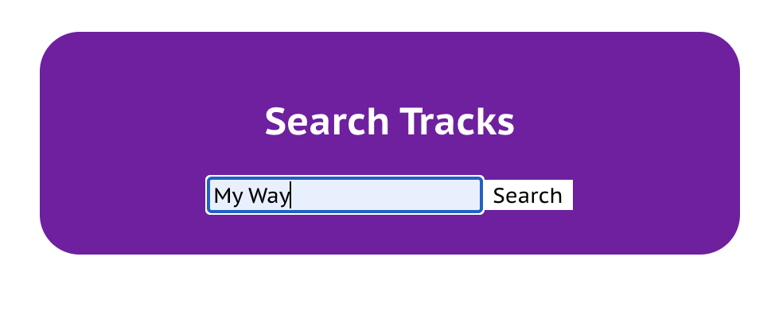
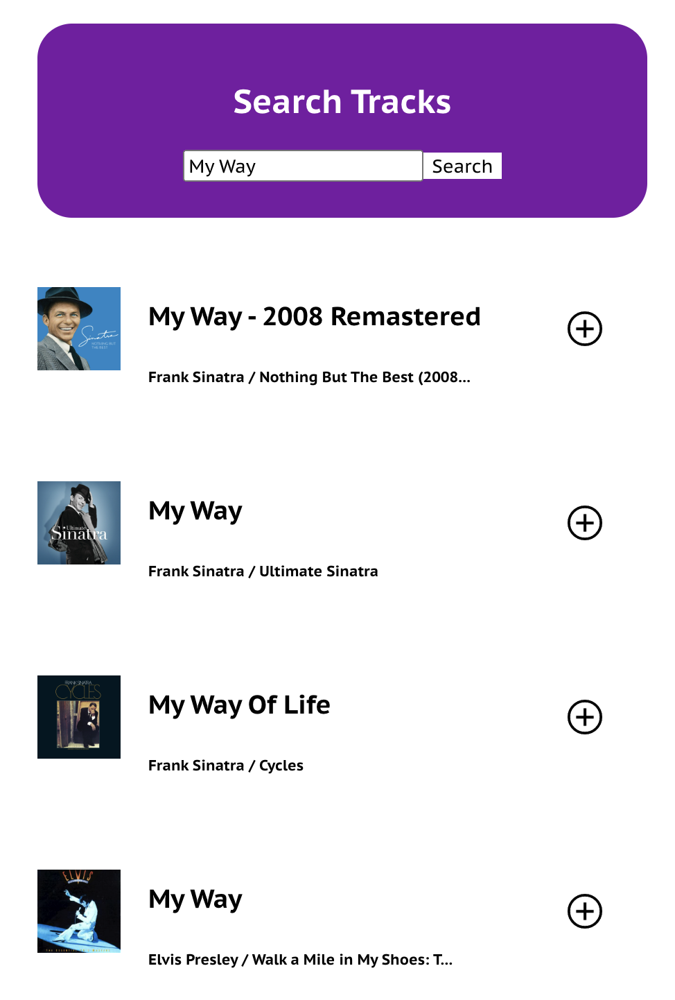

# Jammming App Demo

## Search Tracks Feature

### The Objective

The goal for this project is to develop a feature which allows Spotify users to search song tracks from Spotify’s API and presents a track list based on the input for search.

### Requirements/Background

If users need to create and save their own playlist to their Spotify profile, there needs to be a feature to search songs by user input and the use of the API. Using the documentation on the Spotify API calls with code snippets, I implemented the following tasks for the feature:
-	Allow the value of the search bar to update every letter typed by the user as input.
-	Execute lines of code to begin GET request API call when the user clicks the search button.
-	Execute GET request API call to retrieve all the song tracks based on input value. 

### Technical Design

At the beginning, I created the following React components to implement this feature: *App, SearchResults, SearchBar, and Tracklist*.

In *App.js*, we want to pass the following functions/variables as props to SearchResults: *search, addTrack, and tracks*. Inside of *SearchResults.js*, a div element is rendered which consists: another div element sectioning the part where the user gives input to the *SearchBar* to find a list of tracks based on the input and a Tracklist below the second div element which displays the list of songs after submission of the input. 

Then, I passed the *onSearch* function into *SearchBar* as a prop, and in *SearchBar.js*, the *onSearch* is utilized in a callback function assigned to *search*. Within this function, *onSearch* takes the value from the input element as an argument and the input value changes in every character typed by the user which is executed in the *onChange* function in the file. In order for *search* to be called and executed, the user has to click the button, "Search," which *onClick* is an attribute of this button element to call *search*.

After *search* is called, the program calls *onSearch* which points all the way back to *App.js* where search as a callback function was initially declared and it executes *Spotify.search* from *Spotify.js*. Now, we're going to explore what happens in *Spotify.search* looking at the function in *Spotify.js*. In *Spotify.search*, it uses one parameter named *term* which represents the value of the user's input to search for song tracks. This function returns a Promise value by fetching "``https://api.spotify.com/v1/search?type=track&q=${term}``" to GET the song tracks while the *headers* in this call is assigned to the following: "{Authorization: ``Bearer ${accessToken}``}". The variable, *accessToken*, represents the token to access information from Spotify API after the user is granted authorization. Afterwards, *.then()* is called which returns *response.json()* and another *.then()* is called which uses the JSON response to return an array of objects which every object is a song track itself with the following properties: *id*, *name*, *artist*, *album*, *image*, and *uri*.

For more insight on the functions and variables used for this feature, take a look at the source code to view comments explaining the code.

Summary of the technical design:
-	Create a function, onChange, in <SearchBar/> to change the value of the user input as the user is typing a term or keyword in the search bar.
-	Pass in the onSearch function and the “tracks” variable as props to the React components <SearchResults/> and <SearchBar/> to make the GET request for song tracks based on user input.
-	Implement <Tracklist/> to display all the song tracks stored in the variable “tracks.”

### Caveats

## Save Playlist Feature

### The Objective

### Requirements/Background

### Technical Design

### Caveats

